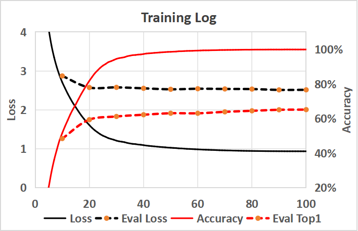
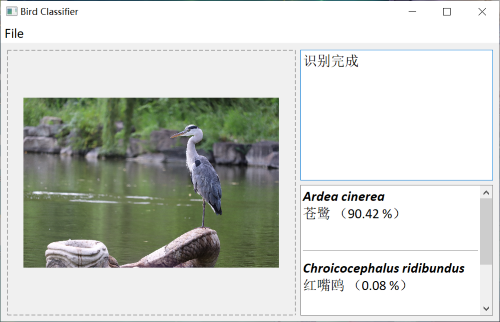

# Bird Classification
**Classifier & dataset for common bird species in China**

## Overview 简介 (Ver 1.5, 2025/09)

This project aims to classify common bird species in China (373 species) with a CNN. We also provide our image dataset (220k) for training and testing. Besides, we provide a simple GUI for easy classification.

--------------------------------------------------

该项目使用了卷积神经网络，以实现对中国常见鸟类（共373种）的图像分类识别，并提供了所使用的图像数据集（22万）。此外，我们提供了一个简单的GUI以方便用户使用。

## Image Dataset

The image dataset is collected from iNaturalist. It contains ~ 220K images of 373 species, and 80% are used for training. Each species has at least 50 iamges. About details, please refer to ``species_list.csv``, and [*Note.md*](./birdData/Note.md).

## Model Details

The model is a CNN network, adopting the ConvNeXt architecture. Its input should be a 224x224 RGB image.

The latest basic model (Ver 1.5) has **12M params**, and accuracy on test set reaches **62.16% (top1) / 74.87% (top3)**. Training (100 epochs) takes less than 1 day on an A100 GPU.

## Usage 如何使用

- Dataset Link: [*Click Here*](https://disk.pku.edu.cn/link/AABC306D3787554C6BAF4C92652F54D21B)
password：firefly

--------------------------------------------------
- It's recommended to use Nvidia CUDA decive, while CPU and Intel XPU are also supported.
- **Dataset**: The dataset is available on cloud disk. Download it to ``birdData`` folder and unzip the packages, then you can use it to train your own model.
- **Training**: Run ``_train.py`` to train the model, and then run ``_test.py`` to test trained model. Pretrained model is available in ``trained`` folder.
- **Classification GUI**: Run ``BirdGUI.py``, and then you can easily classify your own image with our GUI. You can simply drag and drop your image to the window, or select your image from the file dialog.

--------------------------------------------------
- 建议使用英伟达CUDA设备加速计算。同样支持CPU和英特尔XPU计算。
- **数据集**: 您可以从云盘中下载数据集。下载到``birdData``文件夹中并解压后，即可使用它来训练自己的模型。
- **训练**: 运行``_train.py``来训练模型，再运行``_test.py``来测试训练好的模型。预训练模型在``trained``文件夹中。
- **分类GUI**: 运行``BirdGUI.py``，然后您可以轻松地使用我们的GUI来识别自己的图像。您可以直接将图像拖放到窗口中，或者从文件对话框中选择图像。

--------------------------------------------------

## Requirements

- Python 3.12
- Torch
- Torchvision
- Numpy
- PyQt5
- *Tqdm (not necessary for GUI)*
- *Torchinfo (not necessary for GUI)*

## Main Updates

- **Ver 0.0:** (Abandoned)

- **Ver 1.0:** (2025/07)

    We have collected a larger dataset and slightly changed the model architecture. The accuracy on test set reaches 62.16% (top1) / 74.87% (top3). **Ver1 is a complete superior replacement for Ver0.**

- **Ver 1.5:** (2025/09)

    We have trained a larger model (33M params) with the same architecture, with accuracy increasing to 65.11% (top1) / 77.08% (top3). We have also slightly improved the GUI.

## License

This project is licensed under the MIT License.

## Acknowledgments

The image dataset is exported from [iNaturalist](https://www.inaturalist.org) on 2025/03.

Please contact me if you have any suggestions or questions.

Thanks for the help from open source community.