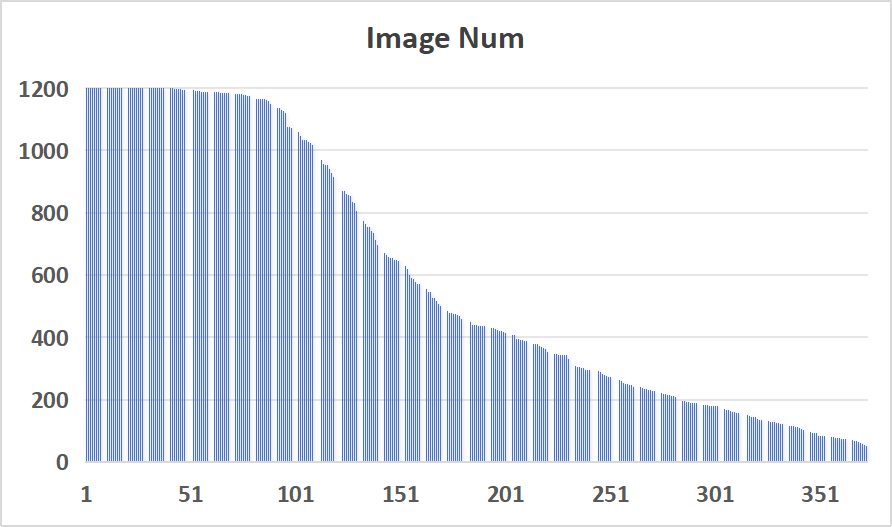

# Bird Image Dataset

## Overview
- **Total photos**: 222759
- **Total species**: 373
- **Test Size**: 20%

## Dataset Link

https://disk.pku.edu.cn/link/AABC306D3787554C6BAF4C92652F54D21B
文件夹名：BirdData
有效期限：2035-04-30 23:59
提取码：firefly

## Data Collection

Bird photos are collected from iNaturalist (https://www.inaturalist.org) on 2025/03.

First, we exported all observations in China from 2000 to 2024, and selected 373 species with at least 50 records as "*common bird species*".

Then, to get more data for training, we exported all observations of these species in Asia (outside China) in 2024.
And to balance the data, we randomly selected about 1,200 photos for species with too many records.

## Failed Downloads
- 143180235	Limosa limosa	黑尾塍鹬	https://static.inaturalist.org/photos/245529083/medium.jpg
**(Retrying successful)**

## Species List

|**scientific name**|**中文名**|
|:------------------|:---------|
|*Abroscopus albogularis*|棕脸鹟莺|
|*Accipiter nisus*|雀鹰|
|*Acridotheres cristatellus*|八哥|
|*Acridotheres tristis*|家八哥|
|*Acrocephalus bistrigiceps*|黑眉苇莺|
|*Acrocephalus orientalis*|东方大苇莺|
|*Actinodura cyanouroptera*|蓝翅希鹛|
|*Actitis hypoleucos*|矶鹬|
|*Aegithalos caudatus*|北长尾山雀|
|*Aegithalos concinnus*|红头长尾山雀|
|*Aegithalos glaucogularis*|银喉长尾山雀|
|*Aethopyga christinae*|叉尾太阳鸟|
|*Aethopyga gouldiae*|蓝喉太阳鸟|
|*Aethopyga siparaja*|黄腰太阳鸟|
|*Agropsar sturninus*|北椋鸟|
|*Aix galericulata*|鸳鸯|
|*Alauda gulgula*|小云雀|
|*Alcedo atthis*|普通翠鸟|
|*Alcippe davidi*|灰眶雀鹛|
|*Alcippe hueti*|淡眉雀鹛|
|*Alophoixus pallidus*|白喉冠鹎|
|*Amaurornis phoenicurus*|白胸苦恶鸟|
|*Anarhynchus alexandrinus*|环颈鸻|
|*Anarhynchus leschenaultii*|铁嘴沙鸻|
|*Anas acuta*|针尾鸭|
|*Anas crecca*|绿翅鸭|
|*Anas platyrhynchos*|绿头鸭|
|*Anas zonorhyncha*|斑嘴鸭|
|*Anastomus oscitans*|钳嘴鹳|
|*Anser albifrons*|白额雁|
|*Anser anser*|灰雁|
|*Anser cygnoides*|鸿雁|
|*Anser indicus*|斑头雁|
|*Anser serrirostris*|短嘴豆雁|
|*Anthus cervinus*|红喉鹨|
|*Anthus hodgsoni*|树鹨|
|*Anthus japonicus*|黄腹鹨|
|*Anthus richardi*|理氏鹨|
|*Anthus roseatus*|粉红胸鹨|
|*Anthus spinoletta*|水鹨|
|*Apus apus*|普通雨燕|
|*Apus nipalensis*|小白腰雨燕|
|*Aquila chrysaetos*|金雕|
|*Ardea alba*|大白鹭|
|*Ardea cinerea*|苍鹭|
|*Ardea coromanda*|牛背鹭|
|*Ardea intermedia*|中白鹭|
|*Ardea purpurea*|草鹭|
|*Ardeola bacchus*|池鹭|
|*Arenaria interpres*|翻石鹬|
|*Asio flammeus*|短耳鸮|
|*Asio otus*|长耳鸮|
|*Athene noctua*|纵纹腹小鸮|
|*Aythya baeri*|青头潜鸭|
|*Aythya ferina*|红头潜鸭|
|*Aythya fuligula*|凤头潜鸭|
|*Aythya nyroca*|白眼潜鸭|
|*Bambusicola thoracicus*|灰胸竹鸡|
|*Bombycilla garrulus*|太平鸟|
|*Bombycilla japonica*|小太平鸟|
|*Botaurus sinensis*|黄苇鳽|
|*Botaurus stellaris*|大麻鳽|
|*Bubo bubo*|雕鸮|
|*Bucephala clangula*|鹊鸭|
|*Butastur indicus*|灰脸鵟鹰|
|*Buteo hemilasius*|大鵟|
|*Buteo japonicus*|普通鵟|
|*Butorides striata*|绿鹭|
|*Cairina moschata*|疣鼻栖鸭|
|*Calidris acuminata*|尖尾滨鹬|
|*Calidris alba*|三趾滨鹬|
|*Calidris alpina*|黑腹滨鹬|
|*Calidris ferruginea*|弯嘴滨鹬|
|*Calidris pygmaea*|勺嘴鹬|
|*Calidris ruficollis*|红颈滨鹬|
|*Calidris subminuta*|长趾滨鹬|
|*Calidris temminckii*|青脚滨鹬|
|*Calidris tenuirostris*|大滨鹬|
|*Calliope calliope*|红喉歌鸲|
|*Caprimulgus jotaka*|普通夜鹰|
|*Carpodacus dubius*|白眉朱雀|
|*Cecropis daurica*|金腰燕|
|*Centropus sinensis*|褐翅鸦鹃|
|*Ceryle rudis*|斑鱼狗|
|*Chalcophaps indica*|绿翅金鸠|
|*Chlidonias hybrida*|灰翅浮鸥|
|*Chlidonias leucopterus*|白翅浮鸥|
|*Chloris sinica*|金翅雀|
|*Chloropsis hardwickii*|橙腹叶鹎|
|*Chroicocephalus brunnicephalus*|棕头鸥|
|*Chroicocephalus ridibundus*|红嘴鸥|
|*Ciconia boyciana*|东方白鹳|
|*Ciconia nigra*|黑鹳|
|*Cinclus pallasii*|褐河乌|
|*Cinnyris ornatus*|黄腹花蜜鸟|
|*Circus cyaneus*|白尾鹞|
|*Circus spilonotus*|白腹鹞|
|*Cisticola juncidis*|棕扇尾莺|
|*Coccothraustes coccothraustes*|锡嘴雀|
|*Coloeus dauuricus*|达乌里寒鸦|
|*Columba livia*|原鸽|
|*Columba rupestris*|岩鸽|
|*Copsychus malabaricus*|白腰鹊鸲|
|*Copsychus saularis*|鹊鸲|
|*Corvus corone*|小嘴乌鸦|
|*Corvus frugilegus*|秃鼻乌鸦|
|*Corvus macrorhynchos*|大嘴乌鸦|
|*Corvus torquatus*|白颈鸦|
|*Crossoptilon crossoptilon*|白马鸡|
|*Cuculus canorus*|大杜鹃|
|*Culicicapa ceylonensis*|方尾鹟|
|*Cyanoderma ruficeps*|红头穗鹛|
|*Cyanopica cyanus*|灰喜鹊|
|*Cyanoptila cyanomelana*|白腹蓝鹟|
|*Cygnus atratus*|黑天鹅|
|*Cygnus columbianus*|小天鹅|
|*Cygnus cygnus*|大天鹅|
|*Cygnus olor*|疣鼻天鹅|
|*Cyornis hainanus*|海南蓝仙鹟|
|*Delichon dasypus*|烟腹毛脚燕|
|*Dendrocitta formosae*|灰树鹊|
|*Dendrocopos major*|大斑啄木鸟|
|*Dicaeum cruentatum*|朱背啄花鸟|
|*Dicaeum ignipectus*|红胸啄花鸟|
|*Dicrurus hottentottus*|发冠卷尾|
|*Dicrurus leucophaeus*|灰卷尾|
|*Dicrurus macrocercus*|黑卷尾|
|*Egretta eulophotes*|黄嘴白鹭|
|*Egretta garzetta*|小白鹭|
|*Elanus caeruleus*|黑翅鸢|
|*Emberiza aureola*|黄胸鹀|
|*Emberiza chrysophrys*|黄眉鹀|
|*Emberiza cioides*|三道眉草鹀|
|*Emberiza elegans*|黄喉鹀|
|*Emberiza fucata*|栗耳鹀|
|*Emberiza godlewskii*|戈氏岩鹀|
|*Emberiza pallasi*|苇鹀|
|*Emberiza pusilla*|小鹀|
|*Emberiza rustica*|田鹀|
|*Emberiza spodocephala*|灰头鹀|
|*Emberiza tristrami*|白眉鹀|
|*Enicurus leschenaulti*|白额燕尾|
|*Enicurus schistaceus*|灰背燕尾|
|*Enicurus scouleri*|小燕尾|
|*Eophona migratoria*|黑尾蜡嘴雀|
|*Eremophila alpestris*|角百灵|
|*Erpornis zantholeuca*|白腹凤鹛|
|*Erythrogenys gravivox*|斑胸钩嘴鹛|
|*Eudynamys scolopaceus*|噪鹃|
|*Eumyias thalassinus*|铜蓝鹟|
|*Eurystomus orientalis*|三宝鸟|
|*Falco amurensis*|红脚隼|
|*Falco cherrug*|猎隼|
|*Falco peregrinus*|游隼|
|*Falco subbuteo*|燕隼|
|*Falco tinnunculus*|红隼|
|*Ficedula albicilla*|红喉姬鹟|
|*Ficedula mugimaki*|鸲姬鹟|
|*Ficedula strophiata*|橙胸姬鹟|
|*Ficedula zanthopygia*|白眉姬鹟|
|*Fringilla montifringilla*|燕雀|
|*Fulica atra*|白骨顶|
|*Gallinago gallinago*|扇尾沙锥|
|*Gallinula chloropus*|黑水鸡|
|*Gallus gallus*|原鸡|
|*Garrulax canorus*|画眉|
|*Garrulus glandarius*|松鸦|
|*Gelochelidon nilotica*|鸥嘴噪鸥|
|*Glareola maldivarum*|普通燕鸻|
|*Glaucidium cuculoides*|斑头鸺鹠|
|*Gracupica nigricollis*|黑领椋鸟|
|*Grus grus*|灰鹤|
|*Grus japonensis*|丹顶鹤|
|*Grus nigricollis*|黑颈鹤|
|*Gypaetus barbatus*|胡兀鹫|
|*Gyps himalayensis*|高山兀鹫|
|*Haematopus ostralegus*|蛎鹬|
|*Halcyon pileata*|蓝翡翠|
|*Halcyon smyrnensis*|白胸翡翠|
|*Hemixos castanonotus*|栗背短脚鹎|
|*Heterophasia desgodinsi*|黑耳奇鹛|
|*Himantopus himantopus*|黑翅长脚鹬|
|*Hirundo rustica*|家燕|
|*Horornis fortipes*|强脚树莺|
|*Hydrophasianus chirurgus*|水雉|
|*Hydroprogne caspia*|红嘴巨燕鸥|
|*Hypothymis azurea*|黑枕王鹟|
|*Hypsipetes leucocephalus*|黑短脚鹎|
|*Ianthocincla maxima*|大噪鹛|
|*Ichthyaetus ichthyaetus*|渔鸥|
|*Ictinaetus malaiensis*|林雕|
|*Ithaginis cruentus*|血雉|
|*Ixos mcclellandii*|绿翅短脚鹎|
|*Jynx torquilla*|蚁?|
|*Lalage melaschistos*|暗灰鹃鵙|
|*Lanius bucephalus*|牛头伯劳|
|*Lanius cristatus*|红尾伯劳|
|*Lanius schach*|棕背伯劳|
|*Lanius sphenocercus*|楔尾伯劳|
|*Lanius tephronotus*|灰背伯劳|
|*Lanius tigrinus*|虎纹伯劳|
|*Larus crassirostris*|黑尾鸥|
|*Larvivora sibilans*|红尾歌鸲|
|*Leiothrix lutea*|红嘴相思鸟|
|*Leucogeranus leucogeranus*|白鹤|
|*Limosa lapponica*|斑尾塍鹬|
|*Limosa limosa*|黑尾塍鹬|
|*Lonchura punctulata*|斑文鸟|
|*Lonchura striata*|白腰文鸟|
|*Lophospiza trivirgata*|凤头鹰|
|*Lophura nycthemera*|白鹇|
|*Luscinia svecica*|蓝喉歌鸲|
|*Machlolophus spilonotus*|黄颊山雀|
|*Mareca falcata*|罗纹鸭|
|*Mareca penelope*|赤颈鸭|
|*Mareca strepera*|赤膀鸭|
|*Megaceryle lugubris*|冠鱼狗|
|*Mergellus albellus*|斑头秋沙鸭|
|*Mergus merganser*|普通秋沙鸭|
|*Mergus squamatus*|中华秋沙鸭|
|*Milvus migrans*|黑鸢|
|*Monticola rufiventris*|栗腹矶鸫|
|*Monticola solitarius*|蓝矶鸫|
|*Motacilla alba*|白鹡鸰|
|*Motacilla cinerea*|灰鹡鸰|
|*Motacilla citreola*|黄头鹡鸰|
|*Motacilla tschutschensis*|黄鹡鸰|
|*Muscicapa dauurica*|北灰鹟|
|*Muscicapa griseisticta*|灰纹鹟|
|*Muscicapa sibirica*|乌鹟|
|*Myophonus caeruleus*|紫啸鸫|
|*Netta rufina*|赤嘴潜鸭|
|*Nucifraga hemispila*|南方星鸦|
|*Numenius arquata*|白腰杓鹬|
|*Numenius phaeopus*|中杓鹬|
|*Nycticorax nycticorax*|夜鹭|
|*Onychostruthus taczanowskii*|白腰雪雀|
|*Oriolus chinensis*|黑枕黄鹂|
|*Orthotomus sutorius*|长尾缝叶莺|
|*Otus lettia*|领角鸮|
|*Otus sunia*|红角鸮|
|*Pandion haliaetus*|鹗|
|*Panurus biarmicus*|文须雀|
|*Paradoxornis gularis*|灰头鸦雀|
|*Paradoxornis heudei*|震旦鸦雀|
|*Parayuhina diademata*|白领凤鹛|
|*Parus cinereus*|大山雀|
|*Parus monticolus*|绿背山雀|
|*Passer cinnamomeus*|山麻雀|
|*Passer montanus*|麻雀|
|*Pericrocotus cantonensis*|小灰山椒鸟|
|*Pericrocotus solaris*|灰喉山椒鸟|
|*Pericrocotus speciosus*|赤红山椒鸟|
|*Periparus ater*|煤山雀|
|*Periparus rubidiventris*|黑冠山雀|
|*Periparus venustulus*|黄腹山雀|
|*Pernis ptilorhynchus*|凤头蜂鹰|
|*Phalacrocorax carbo*|普通鸬鹚|
|*Phasianus colchicus*|环颈雉|
|*Phoenicurus auroreus*|北红尾鸲|
|*Phoenicurus frontalis*|蓝额红尾鸲|
|*Phoenicurus fuliginosus*|红尾水鸲|
|*Phoenicurus leucocephalus*|白顶溪鸲|
|*Phoenicurus ochruros*|赭红尾鸲|
|*Phoenicurus schisticeps*|白喉红尾鸲|
|*Phylloscopus castaniceps*|栗头鹟莺|
|*Phylloscopus coronatus*|冕柳莺|
|*Phylloscopus fuscatus*|褐柳莺|
|*Phylloscopus inornatus*|黄眉柳莺|
|*Phylloscopus proregulus*|黄腰柳莺|
|*Pica bottanensis*|青藏喜鹊|
|*Pica serica*|喜鹊|
|*Picumnus innominatus*|斑姬啄木鸟|
|*Picus canus*|灰头绿啄木鸟|
|*Platalea leucorodia*|白琵鹭|
|*Platalea minor*|黑脸琵鹭|
|*Pluvialis fulva*|金鸻|
|*Pluvialis squatarola*|灰斑鸻|
|*Podiceps cristatus*|凤头??|
|*Podiceps nigricollis*|黑颈??|
|*Poecile montanus*|褐头山雀|
|*Poecile palustris*|沼泽山雀|
|*Pomatorhinus ruficollis*|棕颈钩嘴鹛|
|*Porphyrio poliocephalus*|紫水鸡|
|*Prinia flaviventris*|黄腹山鹪莺|
|*Prinia inornata*|纯色山鹪莺|
|*Prunella collaris*|领岩鹨|
|*Prunella strophiata*|棕胸岩鹨|
|*Pseudopodoces humilis*|地山雀|
|*Psilopogon asiaticus*|蓝喉拟啄木鸟|
|*Psilopogon virens*|大拟啄木鸟|
|*Pterorhinus berthemyi*|棕噪鹛|
|*Pterorhinus chinensis*|黑喉噪鹛|
|*Pterorhinus davidi*|山噪鹛|
|*Pterorhinus lanceolatus*|矛纹草鹛|
|*Pterorhinus pectoralis*|黑领噪鹛|
|*Pterorhinus perspicillatus*|黑脸噪鹛|
|*Pterorhinus sannio*|白颊噪鹛|
|*Pycnonotus aurigaster*|白喉红臀鹎|
|*Pycnonotus jocosus*|红耳鹎|
|*Pycnonotus sinensis*|白头鹎|
|*Pycnonotus xanthorrhous*|黄臀鹎|
|*Pyrgilauda ruficollis*|棕颈雪雀|
|*Pyrrhocorax pyrrhocorax*|红嘴山鸦|
|*Pyrrhula erythaca*|灰头灰雀|
|*Rallus indicus*|普通秧鸡|
|*Recurvirostra avosetta*|反嘴鹬|
|*Regulus regulus*|戴菊|
|*Remiz consobrinus*|中华攀雀|
|*Rostratula benghalensis*|彩鹬|
|*Rubigula flaviventris*|黑冠黄鹎|
|*Saundersilarus saundersi*|黑嘴鸥|
|*Saxicola ferreus*|灰林?|
|*Saxicola stejnegeri*|东亚石?|
|*Schoeniparus dubius*|褐胁雀鹛|
|*Sibirionetta formosa*|花脸鸭|
|*Sitta europaea*|普通?|
|*Sitta villosa*|黑头?|
|*Spatula clypeata*|琵嘴鸭|
|*Spatula querquedula*|白眉鸭|
|*Spilopelia chinensis*|珠颈斑鸠|
|*Spilornis cheela*|蛇雕|
|*Spinus spinus*|黄雀|
|*Spizixos semitorques*|领雀嘴鹎|
|*Spodiopsar cineraceus*|灰椋鸟|
|*Spodiopsar sericeus*|丝光椋鸟|
|*Staphida torqueola*|栗颈凤鹛|
|*Sterna hirundo*|普通燕鸥|
|*Sternula albifrons*|白额燕鸥|
|*Streptopelia decaocto*|灰斑鸠|
|*Streptopelia orientalis*|山斑鸠|
|*Streptopelia tranquebarica*|火斑鸠|
|*Sturnia sinensis*|灰背椋鸟|
|*Suthora alphonsiana*|灰喉鸦雀|
|*Suthora webbiana*|棕头鸦雀|
|*Tachybaptus ruficollis*|小??|
|*Tadorna ferruginea*|赤麻鸭|
|*Tadorna tadorna*|翘鼻麻鸭|
|*Tarsiger cyanurus*|红胁蓝尾鸲|
|*Terpsiphone incei*|寿带|
|*Thalasseus bergii*|大凤头燕鸥|
|*Thalasseus bernsteini*|中华凤头燕鸥|
|*Thinornis dubius*|金眶鸻|
|*Tringa brevipes*|灰尾漂鹬|
|*Tringa erythropus*|鹤鹬|
|*Tringa glareola*|林鹬|
|*Tringa nebularia*|青脚鹬|
|*Tringa ochropus*|白腰草鹬|
|*Tringa stagnatilis*|泽鹬|
|*Tringa totanus*|红脚鹬|
|*Trochalopteron elliotii*|橙翅噪鹛|
|*Troglodytes troglodytes*|鹪鹩|
|*Turdus cardis*|乌灰鸫|
|*Turdus dissimilis*|黑胸鸫|
|*Turdus eunomus*|斑鸫|
|*Turdus hortulorum*|灰背鸫|
|*Turdus kessleri*|棕背黑头鸫|
|*Turdus mandarinus*|乌鸫|
|*Turdus naumanni*|红尾鸫|
|*Turdus obscurus*|白眉鸫|
|*Turdus pallidus*|白腹鸫|
|*Turdus rubrocanus*|灰头鸫|
|*Turdus ruficollis*|赤颈鸫|
|*Upupa epops*|戴胜|
|*Urocissa erythroryncha*|红嘴蓝鹊|
|*Vanellus cinereus*|灰头麦鸡|
|*Vanellus vanellus*|凤头麦鸡|
|*Xenus cinereus*|翘嘴鹬|
|*Yuhina nigrimenta*|黑颏凤鹛|
|*Yungipicus canicapillus*|星头啄木鸟|
|*Zapornia akool*|红脚苦恶鸟|
|*Zoothera aurea*|怀氏虎鸫|
|*Zosterops simplex*|暗绿绣眼鸟|